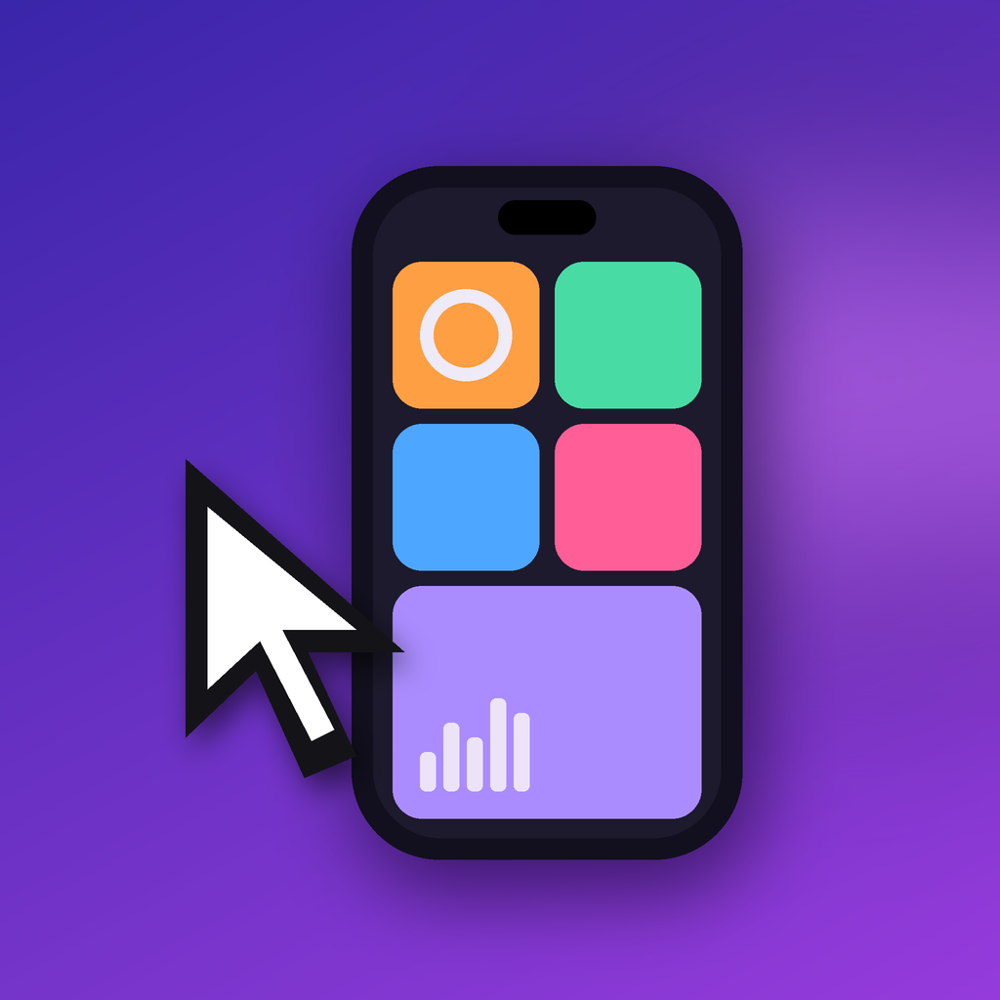
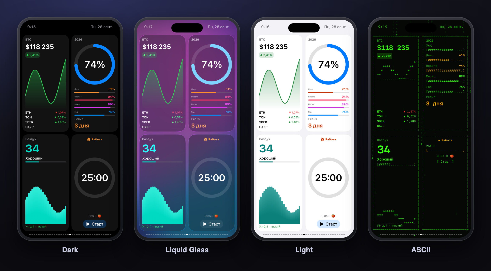
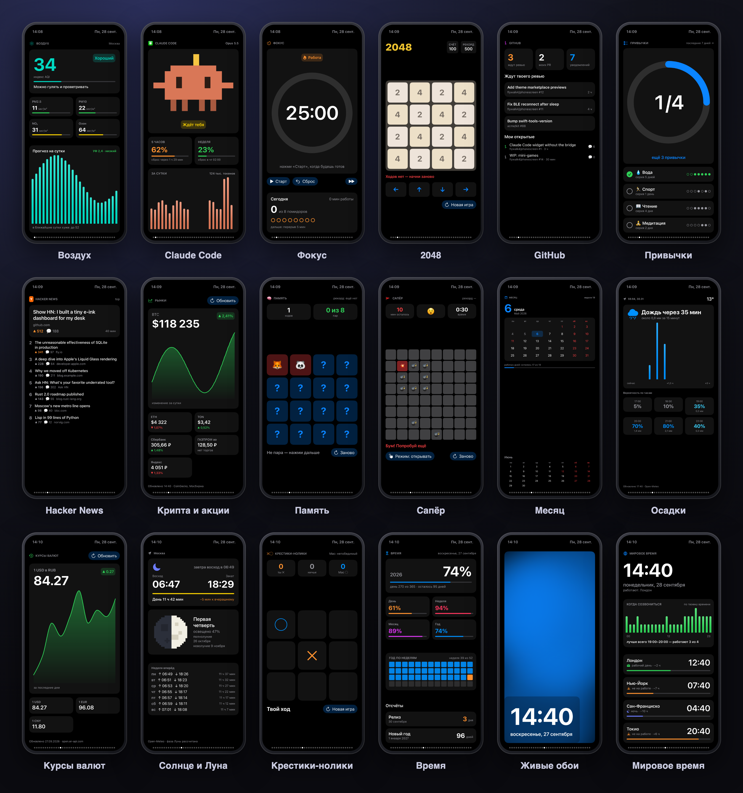
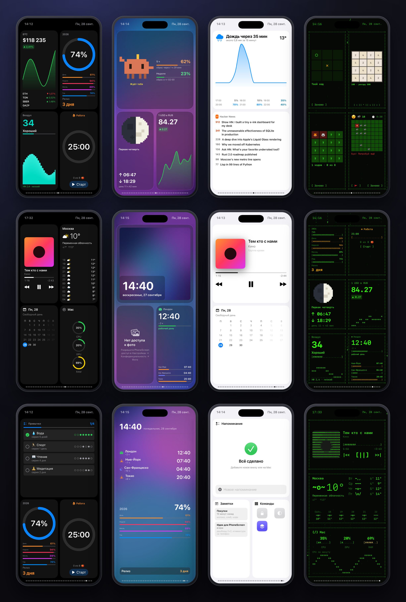
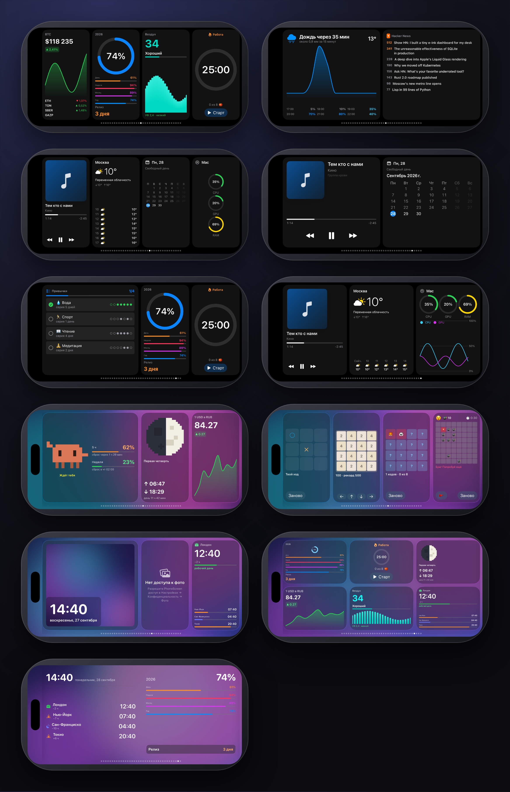
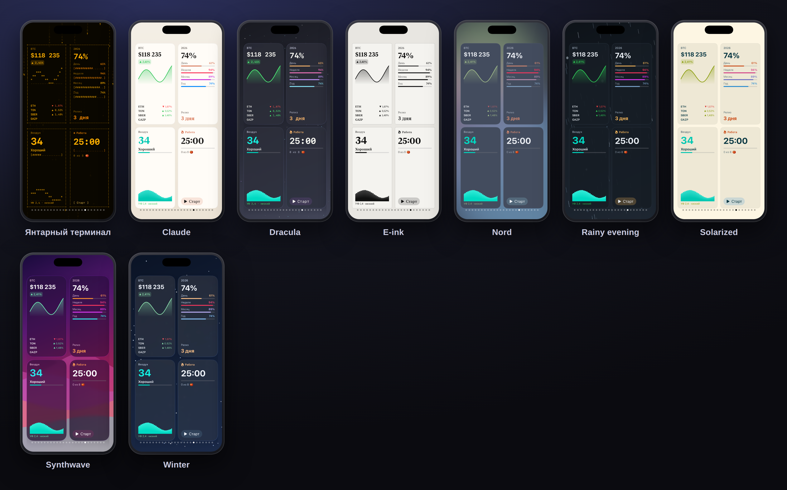

<div align="center">



# PhoneScreen

**Turn your iPhone into a side screen for your Mac.**

Live widgets for music, system load, calendar, weather, crypto, your Claude Code limits, a photo frame and small games.<br>
Move the Mac's cursor off the edge of your display and it lands on the phone.

[](https://github.com/flywalk4/phonescreen/actions/workflows/build.yml)
[](https://github.com/flywalk4/phonescreen/actions/workflows/catalog.yml)


**English** · [Русский](README.ru.md)

[Features](#-features) · [Widgets](#-widgets) · [Themes](#-themes) · [Getting started](#-getting-started) · [Write a widget](#-write-a-widget) · [How it works](#-how-it-works)

<br>



</div>

## ✨ Features

<table>
<tr>
<td width="50%" valign="top">

### 📱 Native, not a mirror
The iPhone draws every widget in SwiftUI. The Mac sends only data, so it stays sharp, smooth and light on battery.

</td>
<td width="50%" valign="top">

### 🔌 Any link that works
USB, Wi-Fi, peer-to-peer Wi-Fi (AWDL) and Bluetooth LE all run at once, and traffic takes the best one. Pull the cable and the session carries on over Wi-Fi.

</td>
</tr>
<tr>
<td valign="top">

### 🖱️ The cursor crosses over
Place the phone at any edge of any display, like in System Settings → Displays. Push the pointer past that edge and you are tapping on the phone.

</td>
<td valign="top">

### 🔄 Edge to edge, any way up
Pages use the whole screen. Lay the phone sideways and every layout reflows: a 2×2 grid becomes a row of four tiles, a full-page widget flows into columns.

</td>
</tr>
<tr>
<td valign="top">

### 🎨 Themes that restyle everything
Dark, light, Liquid Glass (iOS 26), ASCII and a catalog of more, with animated backgrounds: aurora, stars, Matrix rain, waves, bokeh, lava, snow.

</td>
<td valign="top">

### 🧩 Widgets anyone can write
Three small files: a manifest, a declarative `view.json` and a sandboxed `provider.js`. Catalog, live reload and a Node toolkit that works without a Mac.

</td>
</tr>
</table>

## 🧩 Widgets

<p align="center"></p>

**Built in:** 🎵 Music (Apple Music and Spotify, with album art) · 📊 Mac monitor (CPU, GPU, RAM, network) · 📅 Calendar and Reminders (iCloud, straight on the phone) · 📝 Notes · ⛅ Weather · 🚀 Launcher for Dock apps, Shortcuts and system actions · 🖼️ Photo frame that slideshows your Favorites with a slow Ken Burns drift.

**Catalog**, installed from the Mac app with one click:

| | Widget | What it shows |
| :-: | --- | --- |
| 🦀 | **Claude Code** | A pixel crab that reacts to your session, with token use for the 5-hour block and the week |
| 📈 | **Markets** | Crypto and Moscow Exchange stocks, with sparklines |
| 💱 | **Rates** | Currency rates with a 30-day chart |
| 🌧️ | **Rain** | "Rain in 35 min": minute-by-minute nowcast and hourly odds |
| 🌫️ | **Air** | Air quality index, pollutants and a 24-hour forecast |
| 🌅 | **Sky** | Sunrise and sunset, day length and the moon phase |
| 🌍 | **World clock** | Your cities, who is at work and who is asleep |
| ⏳ | **Time** | Progress of the day, week, month and year, plus countdowns |
| 🗓️ | **Month** | Month calendar with weekends, Russian public holidays and working days left |
| 🍅 | **Focus** | A Pomodoro timer with a daily tally |
| ✅ | **Habits** | Tap to check off habits, with streaks and the last seven days as dots |
| 🐙 | **GitHub** | PRs waiting for your review, your open PRs and notifications |
| 📰 | **Hacker News** | Top stories |
| 🌌 | **Live wallpaper** | Animated scenes with an optional clock |
| 🎮 | **Games** | Tic-tac-toe against the Mac, 2048, Minesweeper and Memory, played by tapping the phone |

### Pages

Each widget has three layouts, `full` (a whole page), `medium` (half) and `small` (a tile), so you can mix them. A page holds one widget, two, one big and two small, a 2×2 grid, three stacked, or a 2×3 grid of six tiles.

<p align="center"></p>

### Lying sideways

Put the phone on its side under or next to a display. Grids become a row of tiles, a trio becomes one half-width card and two tiles, and catalog widgets reflow their full-page layout into columns with no extra work from their authors.

<p align="center"></p>

## 🎨 Themes

<p align="center"></p>

A theme is one `theme.json` with colours, font, corner radius, card style (`flat`, `glass` or `ascii`) and an optional animated background. It restyles built-in and catalog widgets alike. In the ASCII theme bars become `[####....]`, rings become percentages, icons become characters and album art becomes ASCII art.

**In the catalog:** Catppuccin · Dracula · Gruvbox · Nord · Tokyo Night · Solarized · Synthwave · Graphite · Pastel bento · amber and e-ink terminals · snow and rain scenes.

<details>
<summary><b>🎛️ Fine-tuning: make any theme yours</b></summary>
<br>

In the Mac app under **Темы…** (Themes), **Тонкая настройка** (fine-tuning) adjusts whichever theme you picked:

- accent colour, card style (fill, glass, ASCII), font and corner radius
- the animated background and its speed, or a blurred photo from the phone's Favorites
- gaps between cards, page margins, padding inside cards
- card opacity (let the live background show through) and a soft shadow
- text size, pages that turn by themselves, a light vibration on taps
- the time and date beside the Dynamic Island, and the page dots

Any page can also drop its cards so the widgets sit straight on the background. Themes can set the same through an optional `layout` block in `theme.json`.

</details>

## 🚀 Getting started

> **Requirements:** macOS 14+, iOS 18+, Xcode 16+ and [XcodeGen](https://github.com/yonaskolb/XcodeGen).

```bash
brew install xcodegen
git clone https://github.com/flywalk4/phonescreen.git && cd phonescreen
xcodegen generate
open PhoneScreen.xcodeproj
```

1. **Mac:** run the `PhoneScreenMac` scheme. A menu bar icon appears. The first time it fetches a track, macOS asks for permission to control Music or Spotify.
2. **iPhone:** run the `PhoneScreeniOS` scheme on your phone. Set your team in Xcode → Signing, or run `DEVELOPMENT_TEAM=XXXXXXXXXX xcodegen generate`. Allow **Local Network** access when iOS asks (USB works without it).
3. **Place the phone:** menu bar → **Расположение iPhone…** (iPhone position). Drag the phone to any edge of any screen. The cursor crosses over the green segment. Press `R` to rotate it.
4. **Add widgets and themes:** menu bar → **Виджеты…** / **Темы…** (Widgets / Themes).

> [!NOTE]
> The Mac interface is in Russian for now. With a free Apple ID the iPhone build lasts 7 days; after that, build again.

| Hotkey | Action |
| --- | --- |
| <kbd>⌃</kbd><kbd>⌥</kbd><kbd>←</kbd> / <kbd>⌃</kbd><kbd>⌥</kbd><kbd>→</kbd> | Previous / next page |
| <kbd>⌃</kbd><kbd>⌥</kbd><kbd>1</kbd>…<kbd>9</kbd> | Jump to a page |

## 🔧 Write a widget

```bash
node scripts/widget-dev.mjs new com.you.hello --name "Hello"      # a working starter widget
node scripts/widget-dev.mjs watch catalog/widgets/com.you.hello   # re-renders preview.png on every save
node scripts/widget-dev.mjs test catalog/widgets/com.you.hello    # runs its fixtures
```

<table>
<tr>
<th>provider.js — runs on the Mac</th>
<th>view.json — drawn by the iPhone</th>
</tr>
<tr>
<td valign="top">

```js
// JavaScriptCore sandbox; fetch only
// the hosts listed in the manifest
async function refresh(ctx) {
  const res = await fetch("https://api.example.com/price");
  const { price, change } = await res.json();
  return {
    price: format.number(price, 2),
    change: format.change(change),
    color: format.changeColor(change),
  };
}
```

</td>
<td valign="top">

```json
{ "full": { "type": "vstack", "children": [
  { "type": "text", "text": "{{price}}",
    "size": 64, "weight": "bold",
    "design": "rounded" },
  { "type": "text", "text": "{{change}}",
    "color": "{{color}}" } ] } }
```

</td>
</tr>
</table>

<details>
<summary><b>What you get as a widget author</b></summary>
<br>

- **16 node types:** stacks, grids, lists, boxes, text, SF Symbols, gauges, progress bars, line, area and bar charts, buttons, pixel sprites, layers and animated scenes. Every node follows the theme.
- **Typed settings:** `text`, `choice` (a drop-down with `options`), `toggle` (a switch) or `number` (a slider or stepper with `min`/`max`/`step`/`unit`). The Mac app draws them and changes reach the phone at once.
- **Sandbox:** `fetch` (declared hosts only), Keychain secrets, settings, 64 KB of storage, read-only access to declared files, and number and date helpers in `format`.
- **Autocomplete:** JSON Schemas in [`schemas/`](schemas) cover `view.json`, `manifest.json` and `theme.json` in VS Code.
- **Live reload:** in the Mac app, **Виджеты → Папка разработки…** (development folder) reloads a widget on the phone every time you save.
- **CI:** validates every catalog widget and theme, runs its fixtures, builds both apps and takes real Simulator screenshots.

</details>

📖 Full reference: [`catalog/README.md`](catalog/README.md) (in Russian) · 🤖 Skill for AI agents: [`skills/phonescreen-widget`](skills/phonescreen-widget/SKILL.md)

## 🔍 How it works

```
Mac (menu bar agent)                                   iPhone
┌──────────────────────────────┐   USB · Wi-Fi ·    ┌──────────────────────────┐
│ providers: music, system, …  │   AWDL · BLE       │ pages of widgets         │
│ JS widgets in JavaScriptCore │ ─────────────────▶ │ SwiftUI, themed          │
│   provider.js → data         │   JSON frames      │ view.json + data → UI    │
│ pointer capture at the edge  │ ◀───────────────── │ taps, actions, pointer   │
└──────────────────────────────┘                    └──────────────────────────┘
```

| Path | What's inside |
| --- | --- |
| [`Packages/PhoneScreenKit`](Packages/PhoneScreenKit) | The shared protocol (`Message`, length-prefixed JSON frames), channels, widget templates and themes |
| [`Mac/`](Mac) | The menu bar agent: usbmuxd, Bonjour and BLE links, data providers, the widget runtime, pointer handoff and hotkeys |
| [`iOS/`](iOS) | The phone app: the listener, pages, built-in widgets, the themed renderer for custom widgets, animated scenes |
| [`catalog/`](catalog) | Widgets and themes with an `index.json` of SHA-256 hashes. The app refuses any file whose hash doesn't match |

```bash
cd Packages/PhoneScreenKit && swift test        # protocol, templates, themes
node scripts/widget-dev.mjs test                # every widget scenario, no Mac needed
```

<div align="center">
<br>
<sub>Made for a desk with an iPhone lying next to the Mac.</sub>
</div>
