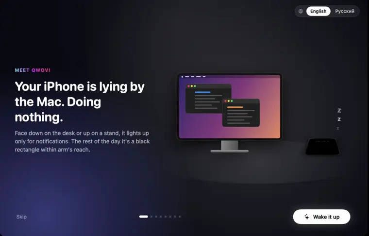
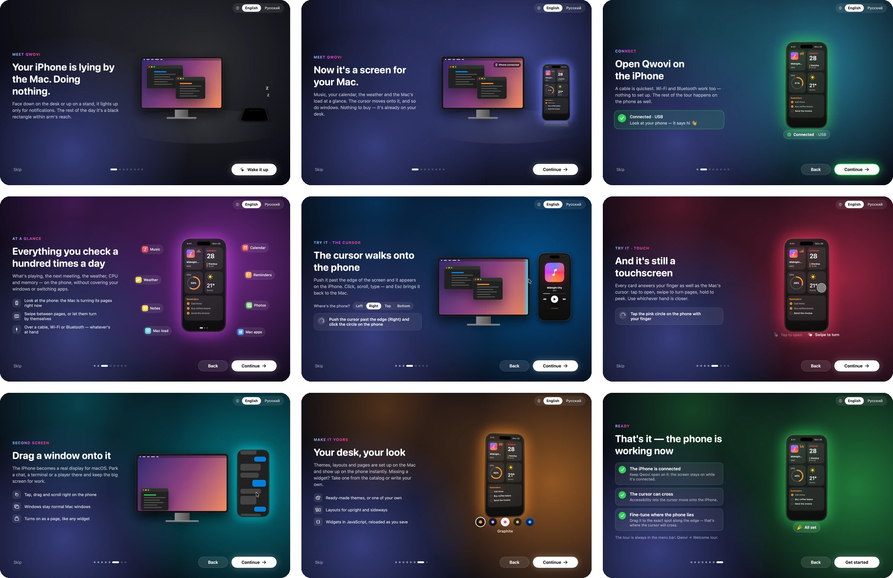
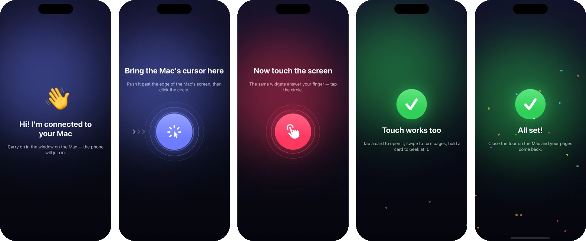

<div align="center">


# Qwovi

**Turn your iPhone into a side screen for your Mac.**

Live widgets for music, system load, calendar, weather, crypto, your Claude Code limits, a photo frame and small games.<br>
Move the Mac's cursor off the edge of your display and it lands on the phone.

[](https://github.com/flywalk4/qwovi/actions/workflows/build.yml)
[](https://github.com/flywalk4/qwovi/actions/workflows/catalog.yml)


[](LICENSE)
[](https://github.com/flywalk4/qwovi/releases/latest)

**English** · [Русский](README.ru.md)

[Welcome tour](#-welcome-tour) · [Features](#-features) · [Widgets](#-widgets) · [Themes](#-themes) · [Second screen](#-second-screen) · [Install](#-install) · [Getting started](#-getting-started) · [Write a widget](#-write-a-widget) · [How it works](#-how-it-works)

<br>


</div>

## 👋 Welcome tour

Most of the day your iPhone just lies next to the keyboard — face down on the desk or up on a stand, lighting up only for notifications. On first launch Qwovi opens a tour that wakes it up, and **the phone takes part**: it says hi as soon as it connects, asks you to bring the Mac's cursor over and click, then to tap with your finger — and the Mac ticks each step off as you do it.

<a href="docs/images/tour/tour.mp4"></a>

<sub>▶ [The same tour as a full-quality video](docs/images/tour/tour.mp4)</sub>



**Meanwhile on the phone** — a hello, a target for the Mac's cursor, one for your finger, and confetti:



The tour speaks English and Russian (switch in its corner) and is always in the menu bar: **Qwovi → Welcome tour**.

## ✨ Features

<table>
<tr>
<td width="50%" valign="top">

### 📱 Native, not a mirror
The iPhone draws every widget in SwiftUI. The Mac sends only data, so it stays sharp, smooth and light on battery.

</td>
<td width="50%" valign="top">

### 🔌 Any link that works
USB, Wi-Fi, peer-to-peer Wi-Fi (AWDL) and Bluetooth LE all run at once, and traffic takes the best one. Pull the cable and the session carries on over Wi-Fi.

</td>
</tr>
<tr>
<td valign="top">

### 🖱️ The cursor crosses over
Place the phone at any edge of any display, like in System Settings → Displays. Push the pointer past that edge and you are tapping on the phone.

</td>
<td valign="top">

### 🔄 Edge to edge, any way up
Pages use the whole screen. Lay the phone sideways and every layout reflows: a 2×2 grid becomes a row of four tiles, a full-page widget flows into columns.

</td>
</tr>
<tr>
<td valign="top">

### 🎨 Themes that restyle everything
Dark, light, Liquid Glass (iOS 26), ASCII and a catalog of more, with animated backgrounds: aurora, stars, Matrix rain, waves, bokeh, lava, snow.

</td>
<td valign="top">

### 🧩 Widgets anyone can write
Three small files: a manifest, a declarative `view.json` and a sandboxed `provider.js`. Catalog, live reload and a Node toolkit that works without a Mac.

</td>
</tr>
<tr>
<td colspan="2" valign="top">

### 🖥️ A real second screen
Add the **Second screen** widget and macOS gets a new display right where the phone sits. Drag any window across the edge and it lands on the phone, sharp in HiDPI and streamed as hardware H.264 over USB or Wi-Fi. Tap to click, drag to drag, long-press to right-click, scroll with two fingers.

</td>
</tr>
</table>

## 🧩 Widgets

<p align="center"></p>

**Built in:** 🎵 Music (Apple Music and Spotify, with album art) · 📊 Mac monitor (CPU, GPU, RAM, network) · 📅 Calendar and Reminders (iCloud, straight on the phone) · 📝 Notes · ⛅ Weather · 🚀 Launcher for Dock apps, Shortcuts and system actions · 🖼️ Photo frame that slideshows your Favorites with a slow Ken Burns drift · 🪟 Running apps with live window previews · 🖥️ Second screen: the phone becomes a real display of the Mac.

**Catalog**, installed from the Mac app with one click:

| | Widget | What it shows |
| :-: | --- | --- |
| 🦀 | **Claude Code** | A pixel crab that reacts to your session, with token use for the 5-hour block and the week |
| 📈 | **Crypto & stocks** | Crypto and Moscow Exchange stocks, with sparklines |
| 💱 | **Exchange rates** | Currency rates with a 30-day chart |
| 🌧️ | **Rain** | "Rain in 35 min": minute-by-minute nowcast and hourly odds |
| 🌫️ | **Air** | Air quality index, pollutants and a 24-hour forecast |
| 🌅 | **Sun & Moon** | Sunrise and sunset, day length and the moon phase |
| 🌍 | **World clock** | Your cities, who is at work and who is asleep |
| ⏳ | **Time** | Progress of the day, week, month and year, plus countdowns |
| 🗓️ | **Month** | Month calendar with weekends, Russian public holidays and working days left |
| 🍅 | **Focus** | A Pomodoro timer with a daily tally |
| ✅ | **Habits** | Tap to check off habits, with streaks and the last seven days as dots |
| 🐙 | **GitHub** | PRs waiting for your review, your open PRs and notifications |
| 📰 | **Hacker News** | Top stories |
| 🌌 | **Live wallpaper** | Animated scenes with an optional clock |
| 🎮 | **Games** | Tic-tac-toe against the Mac, 2048, Minesweeper and Memory, played by tapping the phone |

### Pages

Each widget has three layouts, `full` (a whole page), `medium` (half) and `small` (a tile), so you can mix them. A page holds one widget, two, one big and two small, a 2×2 grid, three stacked, or a 2×3 grid of six tiles.

<p align="center"></p>

### Lying sideways

Put the phone on its side under or next to a display. Grids become a row of tiles, a trio becomes one half-width card and two tiles, and catalog widgets reflow their full-page layout into columns with no extra work from their authors.

<p align="center"></p>

## 🎨 Themes

<p align="center"></p>

A theme is one `theme.json` with colours, font, corner radius, card style (`flat`, `glass` or `ascii`) and an optional animated background. It restyles built-in and catalog widgets alike. In the ASCII theme bars become `[####....]`, rings become percentages, icons become characters and album art becomes ASCII art.

**In the catalog:** Catppuccin · Dracula · Gruvbox · Nord · Tokyo Night · Solarized · Synthwave · Graphite · Pastel bento · amber and e-ink terminals · snow and rain scenes.

<details>
<summary><b>🎛️ Fine-tuning: make any theme yours</b></summary>
<br>

In the Mac app under **Themes**, **Fine-tuning** adjusts whichever theme you picked:

- accent colour, card style (fill, glass, ASCII), font and corner radius
- the animated background and its speed, or a blurred photo from the phone's Favorites
- gaps between cards, page margins, padding inside cards
- card opacity (let the live background show through) and a soft shadow
- text size, pages that turn by themselves, a light vibration on taps
- the time and date beside the Dynamic Island, and the page dots

Any page can also drop its cards so the widgets sit straight on the background. Themes can set the same through an optional `layout` block in `theme.json`.

</details>

## 📺 Second screen

Not a mirror and not a widget: macOS gets a **real extra display** right where the phone sits in the arrangement. Drag any window across the edge and it lands on the phone — Safari, Xcode, a video, Slack. It stays a normal Mac window, so the keyboard, Mission Control and full-screen apps work as usual.

**Turn it on:** add the **Second screen** widget to a page with the **One** layout and swipe to that page on the phone. The display appears while the page is open; leave it and the display goes away 5 s later, its windows move back to the main screen and return next time. The first time, macOS asks for **Screen Recording** (to stream the picture) and **Accessibility** (to turn touches into clicks).

| On the phone | On the Mac |
| --- | --- |
| Tap | Click |
| Drag with one finger | Drag, windows included |
| Long press (½ s) | Right-click |
| Two fingers | Scroll |
| Type on the Mac's keyboard | Goes to the focused window, as on any display |

- **Sharp:** a HiDPI mode (2 pixels per point), like a Retina screen, encoded in hardware as H.264 at up to 60 fps.
- **Needs USB or Wi-Fi:** Bluetooth is too slow for video, so on Bluetooth alone the page says so and waits.
- **Rotate the phone** and the display turns with it: a wide desktop lying sideways, a tall one upright.
- **Switched it off in System Settings → Displays?** The phone offers to turn it back on rather than doing it behind your back.

<details>
<summary><b>How it works</b></summary>
<br>

The Mac creates the display with the private `CGVirtualDisplay` API at the phone's shape (at least 640 points across, the smallest size macOS offers a HiDPI mode for), captures it with ScreenCaptureKit, encodes frames with VideoToolbox and sends them over the same USB / Wi-Fi link as the widgets. The phone decodes them with `AVSampleBufferDisplayLayer` and sends raw touches back, which the Mac turns into mouse events on that display. The private API is also why Qwovi can't be in the Mac App Store.

</details>

## 📦 Install

Ready-made builds are on the [**Releases**](https://github.com/flywalk4/qwovi/releases/latest) page. They aren't signed by Apple (that takes a paid developer account), so each platform needs one extra step. To build it yourself instead, see [Getting started](#-getting-started).

<details open>
<summary><b>💻 Mac</b> — <code>Qwovi-x.y.z.dmg</code>, macOS 14+, Apple silicon and Intel</summary>
<br>

1. Open the `.dmg` and drag **Qwovi** to **Applications**.
2. Open Qwovi. macOS says it can't check the app for malicious software: click **Done**.
3. Open **System Settings → Privacy & Security**, scroll down and click **Open Anyway** next to Qwovi, then confirm. From now on it opens normally.

Or in Terminal, before the first launch:

```bash
xattr -dr com.apple.quarantine /Applications/Qwovi.app
```

After an update macOS may ask for **Accessibility** and **Screen Recording** again: switch Qwovi off and on in that list.

</details>

<details open>
<summary><b>📱 iPhone</b> — <code>Qwovi-x.y.z.ipa</code>, iOS 18+</summary>
<br>

Install it with your own Apple ID using [Sideloadly](https://sideloadly.io) or [AltStore](https://altstore.io):

1. Connect the iPhone to the Mac with a cable, open Sideloadly, drop the `.ipa` onto it, enter your Apple ID and press **Start**.
2. On the iPhone: **Settings → Privacy & Security → Developer Mode** → on (the phone restarts), then **Settings → General → VPN & Device Management** → trust your Apple ID.
3. A free Apple ID signs apps for 7 days: re-install the same `.ipa` with Sideloadly, or let AltStore refresh it over Wi-Fi by itself.

</details>

Then place the phone and add widgets: steps 3–5 of [Getting started](#-getting-started).

## 🚀 Getting started

> **Requirements:** macOS 14+, iOS 18+, Xcode 16+ and [XcodeGen](https://github.com/yonaskolb/XcodeGen).

```bash
brew install xcodegen
git clone https://github.com/flywalk4/qwovi.git && cd qwovi
xcodegen generate
open Qwovi.xcodeproj
```

1. **Mac:** run the `QwoviMac` scheme. A menu bar icon appears. The first time it fetches a track, macOS asks for permission to control Music or Spotify. The first launch opens the [welcome tour](#-welcome-tour): keep it open while you do step 2 — it waits for the phone, lets you try the cursor and touch on it, and ends in Arrangement.
2. **iPhone:** run the `QwoviiOS` scheme on your phone. Set your team in Xcode → Signing, or run `DEVELOPMENT_TEAM=XXXXXXXXXX xcodegen generate`. Allow **Local Network** access when iOS asks (USB works without it).
3. **Place the phone:** the tour's last step opens it; later, menu bar → **Arrangement**. Drag the phone to any edge of any screen. The cursor crosses over the green segment. Press `R` to rotate it.
4. **Add widgets and themes:** menu bar → **Widgets** / **Themes**.
5. **Second screen (optional):** put the **Second screen** widget on a single-widget page. The first time, macOS asks for **Screen Recording** (to stream the display) and **Accessibility** (to turn taps into clicks). The display appears while that page is on the phone and goes away 5 s after you leave it; windows on it move back and return next time.

> [!NOTE]
> The apps and catalog widgets speak English and Russian: pick the language at the foot of the settings sidebar, and the phone switches with the Mac. With a free Apple ID the iPhone build lasts 7 days; after that, build again.

| Hotkey | Action |
| --- | --- |
| <kbd>⌃</kbd><kbd>⌥</kbd><kbd>←</kbd> / <kbd>⌃</kbd><kbd>⌥</kbd><kbd>→</kbd> | Previous / next page |
| <kbd>⌃</kbd><kbd>⌥</kbd><kbd>1</kbd>…<kbd>9</kbd> | Jump to a page |

## 🔧 Write a widget

```bash
node scripts/widget-dev.mjs new com.you.hello --name "Hello"      # a working starter widget
node scripts/widget-dev.mjs watch catalog/widgets/com.you.hello   # re-renders preview.png on every save
node scripts/widget-dev.mjs test catalog/widgets/com.you.hello    # runs its fixtures
```

<table>
<tr>
<th>provider.js — runs on the Mac</th>
<th>view.json — drawn by the iPhone</th>
</tr>
<tr>
<td valign="top">

```js
// JavaScriptCore sandbox; fetch only
// the hosts listed in the manifest
async function refresh(ctx) {
  const res = await fetch("https://api.example.com/price");
  const { price, change } = await res.json();
  return {
    price: format.number(price, 2),
    change: format.change(change),
    color: format.changeColor(change),
  };
}
```

</td>
<td valign="top">

```json
{ "full": { "type": "vstack", "children": [
  { "type": "text", "text": "{{price}}",
    "size": 64, "weight": "bold",
    "design": "rounded" },
  { "type": "text", "text": "{{change}}",
    "color": "{{color}}" } ] } }
```

</td>
</tr>
</table>

<details>
<summary><b>What you get as a widget author</b></summary>
<br>

- **16 node types:** stacks, grids, lists, boxes, text, SF Symbols, gauges, progress bars, line, area and bar charts, buttons, pixel sprites, layers and animated scenes. Every node follows the theme.
- **Typed settings:** `text`, `choice` (a drop-down with `options`), `toggle` (a switch) or `number` (a slider or stepper with `min`/`max`/`step`/`unit`). The Mac app draws them and changes reach the phone at once.
- **Sandbox:** `fetch` (declared hosts only), Keychain secrets, settings, 64 KB of storage, read-only access to declared files, and number and date helpers in `format`.
- **Autocomplete:** JSON Schemas in [`schemas/`](schemas) cover `view.json`, `manifest.json` and `theme.json` in VS Code.
- **Any language:** texts go in `strings.json` (`t("key")` in code, `{{t.key}}` in the view) with plural forms; numbers and dates from `format` follow the user's language.
- **Live reload:** in the Mac app, **Widgets → Development folder…** reloads a widget on the phone every time you save.
- **CI:** validates every catalog widget and theme, runs its fixtures, builds both apps and takes real Simulator screenshots.

</details>

📖 Full reference: [`catalog/README.md`](catalog/README.md) · 🤖 Skill for AI agents: [`skills/qwovi-widget`](skills/qwovi-widget/SKILL.md)

## 🔍 How it works

```
Mac (menu bar agent)                                   iPhone
┌──────────────────────────────┐   USB · Wi-Fi ·    ┌──────────────────────────┐
│ providers: music, system, …  │   AWDL · BLE       │ pages of widgets         │
│ JS widgets in JavaScriptCore │ ─────────────────▶ │ SwiftUI, themed          │
│   provider.js → data         │   JSON frames      │ view.json + data → UI    │
│ pointer capture at the edge  │ ◀───────────────── │ taps, actions, pointer   │
└──────────────────────────────┘                    └──────────────────────────┘
```

| Path | What's inside |
| --- | --- |
| [`Packages/QwoviKit`](Packages/QwoviKit) | The shared protocol (`Message`, length-prefixed JSON frames), channels, widget templates and themes |
| [`Mac/`](Mac) | The menu bar agent: usbmuxd, Bonjour and BLE links, data providers, the widget runtime, pointer handoff and hotkeys. `Mac/Display` is the second screen: a virtual display (private `CGVirtualDisplay`), ScreenCaptureKit + VideoToolbox H.264, taps → mouse events |
| [`iOS/`](iOS) | The phone app: the listener, pages, built-in widgets, the themed renderer for custom widgets, animated scenes |
| [`catalog/`](catalog) | Widgets and themes with an `index.json` of SHA-256 hashes. The app refuses any file whose hash doesn't match |

```bash
cd Packages/QwoviKit && swift test        # protocol, templates, themes
node scripts/widget-dev.mjs test                # every widget scenario, no Mac needed
```

## 📄 License

[PolyForm Noncommercial 1.0.0](LICENSE) © 2026 Vadim Shalimov

Free for personal, educational, research and other noncommercial use — use it, change it, share it. Commercial use needs a separate license: reach out via [GitHub](https://github.com/flywalk4). Versions published before this change remain available under MIT.

<div align="center">
<br>
<sub>Made for a desk with an iPhone lying next to the Mac.</sub>
</div>
